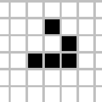

# 🎲 GAME OF LIFE 🎲

  

- El Juego de la vida es un autómata celular diseñado por el matemático británico John Horton Conway en 1970. 
  
## 📒ÍNDICE

- [Introducción](#introducción)
  - [📒ÍNDICE](#índice)
  - [🔰 Acerca de](#-acerca-de)
  - [⚡ Uso](#-uso)
    - [🔌 Instalación](#-instalación)
    - [📦 Comandos](#-comandos)
  - [🔧 Desarrollo](#-desarrollo)
    - [📓 Requisitos previos](#-requisitos-previos)
    - [🔩 Entorno de desarrollo](#-entorno-de-desarrollo)
    - [📁 Estructura de archivos](#-estructura-de-archivos)
  - [📷 Galería](#-galería)
  - [🌟 Crédito/Reconocimiento](#-créditoreconocimiento)

## 🔰 Acerca de

El Juego de la vida es un autómata celular diseñado por el matemático británico John Horton Conway en 1970. Es un juego de cero jugadores, en el que su evolución es determinada por un estado inicial, sin requerir intervención adicional.

## ⚡ Uso

Para usar este proyecto solo tienes que habrir el html.

### 🔌 Instalación

- No se requiere de ninguna instalación. 

### 📦 Comandos

- No se requiere de ningun comando.

## 🔧 Desarrollo

En este proyecto no ha contribuido ninguna otra persona.

### 📓 Requisitos previos

Para poder llevar acabo este proyecto es necesario los siguientes conocimientos:

- HTML
- CSS / SCSS
- JAVASCRIPT

### 🔩 Entorno de desarrollo

Para poder descargar el proyecto diríjase a Code > Download ZIP.

### 📁 Estructura de archivos

La estructura de los archivos es la siguiente:

```r
├── 📁GAME-OF-LIFE
│   ├── 📁css
│   │   ├── style.css
│   │   ├── style.css.map
│   │   └── style.scss
│   │  
│   ├── 📁html
│   │   └── index.html
│   │  
│   ├── 📁img
│   │   ├── GameOfLifeGIF.gif
│   │   └── gameOfLifeICO.gif
│   │  
│   └── 📁js
│       └── script.js
│ 
└── README.md
```

## 📷 Galería

  

## 🌟 Crédito/Reconocimiento

Desarrollado por Nicolás Cabrera Rodríguez
